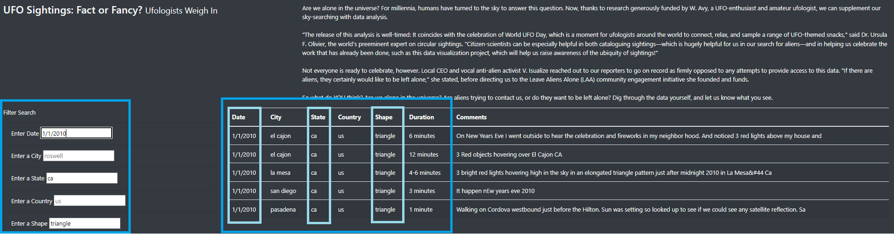

# UFOs

## Overview of Project
Dana wants to create an interactive table on an HTML page to display UFO findings in a cleaner, much eligible way for that community/interested parties. Using HTML, CSS, Javascript and Bootstrap, she manages to create a pretty html page with some filters to update the table containing so many rows of so many UFO sightings.

## Results
The image below is how the page would load on one's browser - unfiltered (and filter boxes are greyed with some default examples of what one can type in).

Using the filters from the left hand side, one can filter on date, city, state, country and/or shape. The image below shows an example where I have filtered for date = 1/1/2020, the state is "ca" and the shape is "triangle". The table (on the right) updates itself as you change fields, to reflect the user input. In order to reset the page hence filters, one can just click on the "UFO Sightings" at the top of the page.

## Summary
One drawback is with the filter, you cannot choose more than 1 option (i.e. you can only choose 1 State at a time).

Here are 2 reccomendations I would bring forward to Dana:
* Having a date range filter (rather than one distinct date) will help analyse periods instead of a by-day basis.
* User input is case-sensitive, I would advise to have it case INsensitive so the user can enter either "CA" or "ca" and it will filter accordingly the table.
